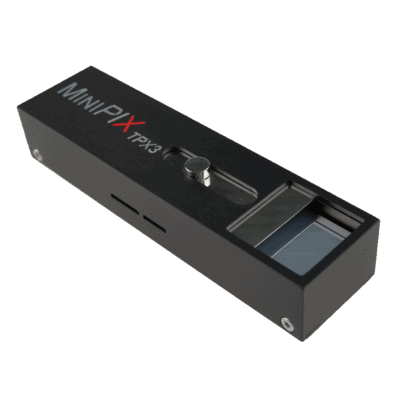

.. _camera-minipix:

Minipix camera
--------------
.. image:: advacam.svg


Introduction
````````````

ADVACAM's imaging cameras are direct conversion single photon counting pixel detectors that represent the cutting edge of current radiation imaging technology. The term “single photon counting” means that every single photon of X-ray radiation detected in individual pixel is processed and counted. The technology brings two major advantages in comparison to the conventional X-ray imaging - high contrast together with sharp high resolution images and spectral information of the radiation that allows material specific information to be displayed in colors.

MiniPIX TPX3 camera is miniaturized and low power radiation camera with the state of art Timepix3 chip. The Timepix3 is the CERN's latest pixel detector chip that records position, energy and time for every detected quantum of radiation.

The Lima module has been tested with Pixet SDK **1.7.8**. A conda package **lima-camera-minipix** is available from anaconda.org esrf-bcu channel

Monochrome and color cameras are supported with these SDK versions.

Installation & Module configuration
```````````````````````````````````

First, you have to install the ADVACAM SDK *Pixel* to the default path ``/opt/pixet``. tgz and deb packages are available from https://downloads.advacam.com/ .

Note: This camera Lima plugin is a pure python module since Advacam only provides a SDK (pixet) for python.

Then, follow the generic instructions in :ref:`build_installation`.

For the Tango server installation, refers to :ref:`tango_installation`.

Initialisation and Capabilities
```````````````````````````````

Implementing a new plugin for new detector is driven by the LIMA framework but the developer has some freedoms to choose which standard and specific features will be made available. This section is supposed to give you the correct information regarding how the camera is exported within the LIMA framework.

Camera initialisation
.....................

The camera will be initialized by creating Minipix.Interface object.

Small example showing possible ways to initialize:

.. code-block:: python

  from Minipix.Interface import Interface
  from Lima import Core

  hwint = Interface(config_path='/opt/pixet/factory/MiniPIX-J06-W0105.xml')

  cam = hwint.camera


Std capabilites
...............

This plugin has been implemented in respect of the mandatory capabilites but with some limitations which
are due to the camera and SDK features. Only restriction on capabilites are documented here.

* HwDetInfo


  getCurrImageType(): It only supports Bpp16.

* HwSync

  get/setTrigMode(): the supported mode are IntTrig, IntTrigMult.

Optional capabilites
....................

N/A

Configuration
`````````````

ADVACAM provides you with a XML configuration file, specific to your detector. Default path can be /opt/pixet/factory, for instance /opt/pixet/factory/MiniPIX-J06-W105.xml, where *J06-W0105* is the product identifier of the detector.

When creating the Minipix Interface object you must passed as argument the path of your XML configuration file:

.. code-block:: python

  hwint = Interface(config_path='/opt/pixet/factory/MiniPIX-J06-W0105.xml')
  
How to use
``````````

This is a python code example for a simple test:

.. code-block:: python

  from Lima import Core
  from Minipix.Interface import Interface 

  hwint = Interface(config_path='/opt/pixet/factory/MiniPIX-J06-W0105.xml')

  cam = hwint.camera

  ct = Core.CtControl(hwint)

  acq = ct.acquisition()


  #
  # set and test an acquisition
  #

  # set an energy threshold and bias voltage

  cam.energy_threshold = 3.6 # in keV
  cam.bias_voltage = 200 # in Volt

  # setting new file parameters and autosaving mode
  saving=ct.saving()

  pars=saving.getParameters()
  pars.directory='/tmp/test_lima'
  pars.prefix='test1_'
  pars.suffix='.h5'
  pars.fileFormat=Core.CtSaving.HDF5BS
  pars.savingMode=Core.CtSaving.AutoFrame
  saving.setParameters(pars)

  # now ask for 0.1 sec. exposure and 100 frames
  acq.setAcqExpoTime(0.1)
  acq.setNbImages(100)

  ct.prepareAcq()
  ct.startAcq()

  # wait for last image (#99) ready
  lastimg = ct.getStatus().ImageCounters.LastImageReady
  while lastimg !=99:
    time.sleep(0.1)
    lastimg = ct.getStatus().ImageCounters.LastImageReady

  # read the first image
  im0 = ct.ReadImage(0)
